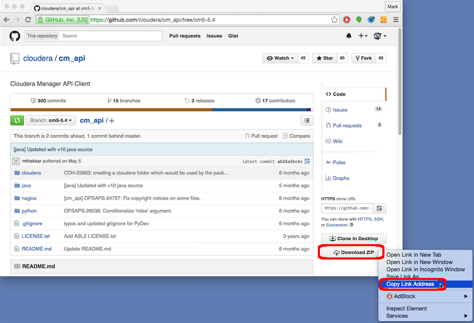
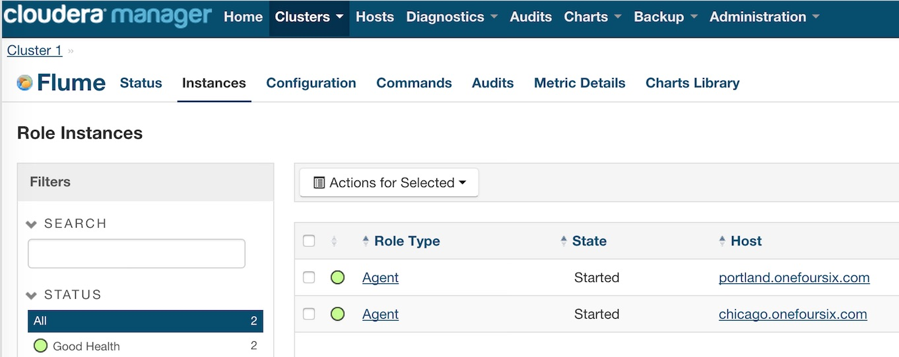

cm-api-flume-example
====================

This project provides an example of using Cloudera Manager's Python API Client to create a Flume Service and Flume Agents, to set and update Flume Agent config files, and to restart Flume Agent processes. Along the way it also shows the use of Cloudera Manager's user roles

More information:  [Flume](http://archive.cloudera.com/cdh5/cdh/5/flume-ng/FlumeUserGuide.html),  [Cloudera Manager](http://www.cloudera.com/content/cloudera/en/products-and-services/cloudera-enterprise/cloudera-manager.html), [CM API Client](http://cloudera.github.io/cm_api/)

####Requirements
- Cloudera Manager 5.2 or higher (I tested with CM 5.4.7)  
- CDH 5.2 or higher (I tested with CDH 5.4.7)
- A configured HDFS Service.
- Python (I tested on CentOS 6.6 which includes Python 2.6.6)
- Python setuptools (see below)
- The correct version of the CM API (see below)
- A CM login with at least "Cluster Administrator" role to create a Flume Service
- A CM login with at least "Cluster Administrator" role to add Agents to a Flume Service 
- A CM login with at least "Configurator" role to deploy an Agent's config file
- A CM login with at least "Operator" role to start or restart Agent(s)

####Install the Cloudera Manager API 
Download the version of the CM API that matches the version of Cloudera Manager you are using. Consult the chart [here](http://cloudera.github.io/cm_api/docs/releases/) to see what version of the the API you will need to install

At the time of this writing, the current version of CM is 5.4.7 and I will install version 10 of the CM API

I've listed below the steps I used on CentOS 6.6 to install the current version (v10) of the Pythin CM API Client for use with CM 5.4.x  (docs are [here](http://cloudera.github.io/cm_api/docs/python-client/)) 

Steps to install the Python CM API Client:

Use a browser to go to [https://github.com/cloudera/cm_api](https://github.com/cloudera/cm_api)

Use the dropdown to pick the branch you need. For example, I will use the branch for CM5.4:

Once the right branch is selected, right-click on the "Download ZIP" button:

In my case for the CM5.4 API (which is the current version at the time of this writing) the link is: 

	https://github.com/cloudera/cm_api/archive/cm5-5.4.zip

If you need an older version, for example, the CM5.2 version, the download link would be:

	https://github.com/cloudera/cm_api/archive/cm5-5.2.zip

Once you have the download link, download the archive on the machine where you want to install the CM API:

	$ wget https://github.com/cloudera/cm_api/archive/cm5-5.4.zip

Install some utils you'll need: 

    $ sudo yum -y install python-setuptools
    $ sudo yum -y install unzip

Unzip the archive:

	$ unzip cm5*.zip

Install the API:

	$ cd cm_api*/python
	$ sudo python setup.py install

####Create a Flume Service

Change to the root of this example's scripts directory and edit the file create-flume-service.py.  Set the following:
- cm_host
- cm_port
- cm_login
- cm_password
- cluster_name
- hdfs_service_name

Execute the create-flume-service.py script passing it the name of the Flume Service you want to create.  
For example:

    ./create-flume-service.py Flume

At this point a Flume Service has been created but still needs to have Agents created and associated with it.
  

####Add an Agent

Edit the file add-agent.py.  Set the following:
- cm_host
- cm_port
- cm_login
- cm_password
- cluster_name

Execute the add-agent.py script passing it the name for the Flume Service, the name of the Agent you want to create and the host the Agent should be deployed on. Note the Agent name will be the value used within the flume.conf file so should typically be a short lowercase name. 

For example:

    ./add-agent.py Flume agent0 portland.onefoursix.com

I will add a second agent deployed on a different machine:

    ./add-agent.py Flume agent1 chicago.onefoursix.com
    
 
Note the script sets each Agent's name:

 
    
####Set or update an Agent's Config File (flume.conf)
Edit the Flume configuration file(s) you want to use to set your Agents' configuration.
In this example there are configuration files for Agents named agent0 and agent1 in the directory flume-conf

Edit the file set-agent-config.py.  Set the following:
- cm_host
- cm_port
- cm_login
- cm_password
- cluster_name
- flume_service_name

Execute the set-agent-config.py script passing it the Agent name and the configuration file.  For example

    ./set-agent-config.py agent0 ../flume-conf/agent0-flume.conf
    
I'll set a different conf file on my second agent:    
    
    ./set-agent-config.py agent1 ../flume-conf/agent1-flume.conf
    
 
We can see both Agents have their own configs:

  
 

         
####Restart an Agent
Edit the file restart-agent.py.  Set the following:
- cm_host
- cm_port
- cm_login
- cm_password
- cluster_name
- flume_service_name

Execute the restart-agent.py script passing it the Agent name.  

I'll restart both agents:

    ./restart-agent.py agent0
    
    ./restart-agent.py agent1

####Viewing the results in Cloudera Manager

Here are the two Agents:

Cloudera Manager's Configuration Tracking and Rollback features tracks all changes - including those made through the API as in this example:

