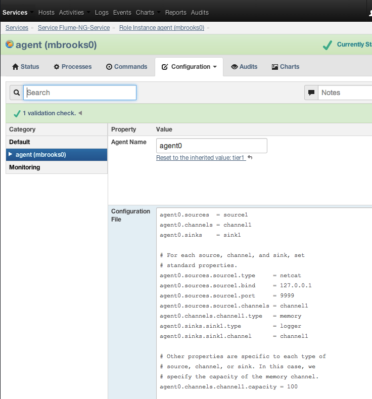
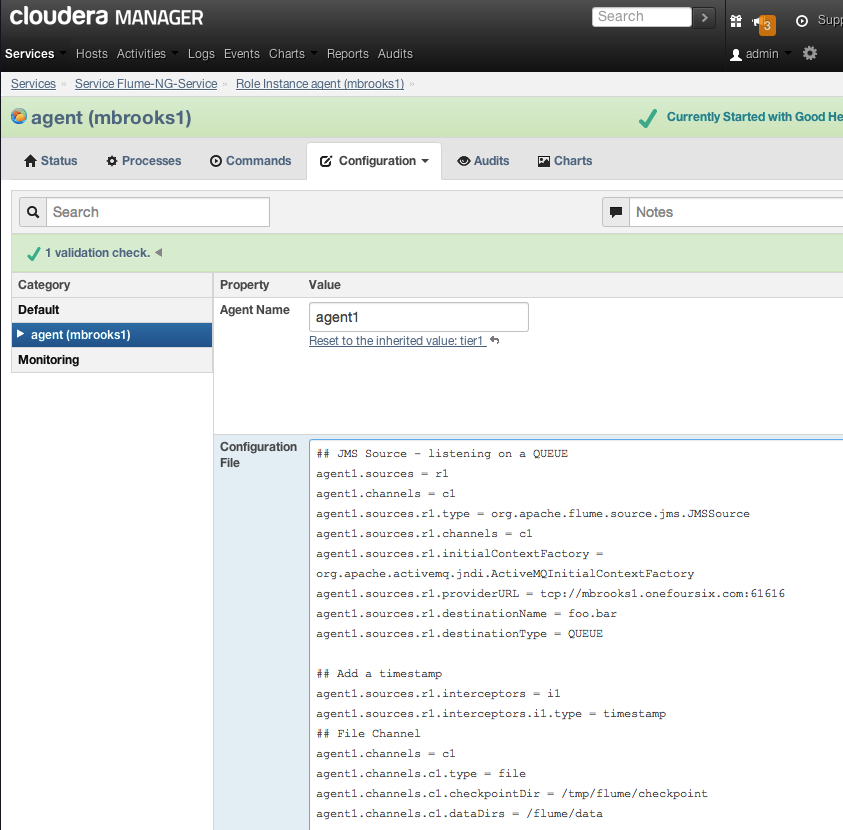
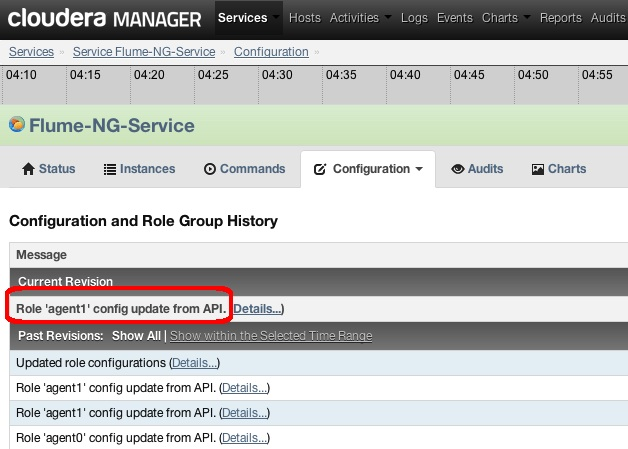

cm-api-flume-example
====================

This project provides an example of using Cloudera Manager's Python API Client to create a Flume Service and Flume Agents, to set and update Flume Agent config files, and to restart Flume Agent processes.

More information:  [Flume](http://archive.cloudera.com/cdh5/cdh/5/flume-ng/FlumeUserGuide.html),  [Cloudera Manager](http://www.cloudera.com/content/cloudera/en/products-and-services/cloudera-enterprise/cloudera-manager.html), [CM API Client](http://cloudera.github.io/cm_api/)

####Requirements
- Cloudera Manager 5.2 or higher (I tested with CM 5.4.7)  
- CM login with Administrator privileges
- CDH 5.3 or higher (I tested with CDH 5.4.7)
- A configured HDFS Service.
- Python (I tested on CentOS 6.6 which includes Python 2.6.6)
- Python setuptools (see below)
- The correct version of the CM API must be installed (see below)

####Install the Cloudera Manager API Python Client
Download the version of the CM API Python Client that matches the version of Cloudera Manager you are using.

Consult the chart [here](http://cloudera.github.io/cm_api/docs/releases/) to see what version of the the API you will need to install

At the time of this writing, the current version of CM is 5.4.7 and I will install the version 10 of the CM API Python Client

Instructions for installing the CM API Python Client are [here](http://cloudera.github.io/cm_api/docs/python-client/) 

Here are the steps I used on CentOS 6.6 to install the current version (v10) of the API for use with CM 5.4.x:

Point your browser to [https://github.com/cloudera/cm_api](https://github.com/cloudera/cm_api)

Use the dropdown to pick the version you need, for example

    $ sudo yum -y install python-setuptools
    $ sudo yum -y install unzip

####Create a Flume-NG Service

Change to the root of this example's scripts directory and edit the file create-flume-service.py.  Set the following:
- cm_host
- cm_port
- cm_login
- cm_password
- cluster_name
- hdfs_service_name

Execute the create-flume-service.py script passing it the name of the Flume-NG Service you want to create.  
For example:

    ./create-flume-service.py Flume-NG-Service

At this point a Flume-NG Service has been created but still needs to have Agents created and associated with it.
  

####Add an Agent

Edit the file add-agent.py.  Set the following:
- cm_host
- cm_port
- cm_login
- cm_password
- cluster_name

Execute the add-agent.py script passing it the name for the Flume-NG Service, the name of the Agent you want to create and the host the Agent should be deployed on. Note the Agent name will be the value used within the flume.conf file so should typically be a short lowercase name. 

For example:

    ./add-agent.py Flume-NG-Service agent0 mbrooks0.onefoursix.com

I will add a second agent deployed on a different machine:

    ./add-agent.py Flume-NG-Service agent1 mbrooks1.onefoursix.com
    
    
####Set or update an Agent's Config File (flume.conf)
Edit the Flume configuration file(s) you want to use to set your Agent's configuration.
In this example there are configuration files for Agents named agent0 and agent1 in the directory flume-conf

Edit the file set-agent-config.py.  Set the following:
- cm_host
- cm_port
- cm_login
- cm_password
- cluster_name
- flume_service_name

Execute the set-agent-config.py script passing it the Agent name and the configuration file.  For example

    ./set-agent-config.py agent0 ../flume-conf/agent0-flume.conf
    
I'll set a different conf file on my second agent:    
    
    ./set-agent-config.py agent1 ../flume-conf/agent1-flume.conf
    
        
####Restart an Agent
Edit the file restart-agent.py.  Set the following:
- cm_host
- cm_port
- cm_login
- cm_password
- cluster_name
- flume_service_name

Execute the restart-agent.py script passing it the Agent name.  

I'll restart both agents:

    ./restart-agent.py agent0
    
    ./restart-agent.py agent1

####Viewing the results in Cloudera Manager

Here we see the Flume-NG Service:

Here are the two Agents:

Here is the flume.conf for agent0

Here is the flume.conf for agent1

Cloudera Manager's Configuration Tracking and Rollback features tracks all changes - including those made through the API as in this example:

