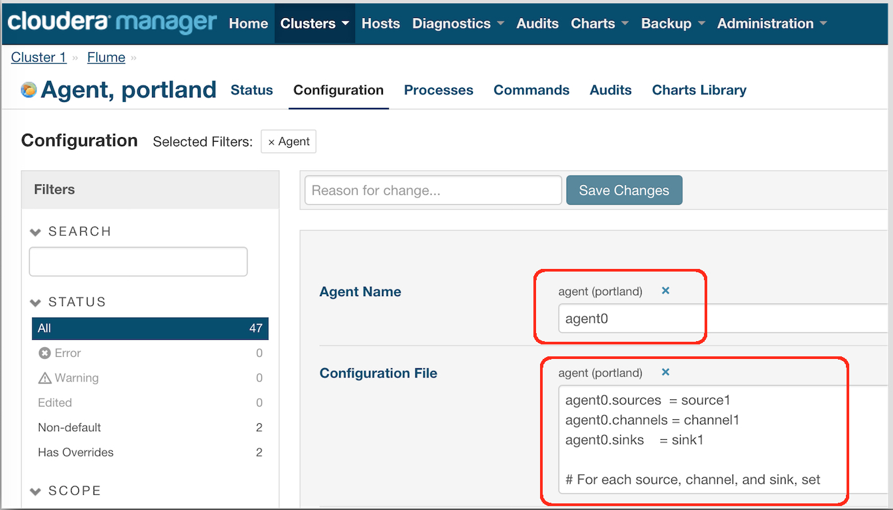
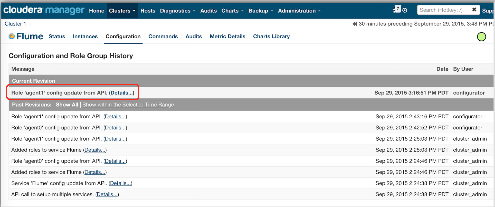

cm-api-flume-example
====================

This project provides an example of using Cloudera Manager's Python API Client to create a Flume Service and Flume Agents, to set and update Flume Agent config files, and to restart Flume Agent processes. Along the way it also shows the use of Cloudera Manager's user roles

More information:  [Flume](http://archive.cloudera.com/cdh5/cdh/5/flume-ng/FlumeUserGuide.html),  [Cloudera Manager](http://www.cloudera.com/content/cloudera/en/products-and-services/cloudera-enterprise/cloudera-manager.html), [CM API Client](http://cloudera.github.io/cm_api/)

####Requirements
- Cloudera Manager 5.2 or higher (I tested with CM 5.4.7)  
- CDH 5.2 or higher (I tested with CDH 5.4.7)
- A configured HDFS Service.
- Python (I tested on CentOS 6.6 which includes Python 2.6.6)
- Python setuptools (see below)
- The correct version of the CM API (see below)
- A CM login with at least "Cluster Administrator" role to create a Flume Service
- A CM login with at least "Cluster Administrator" role to add Agents to a Flume Service 
- A CM login with at least "Configurator" role to deploy an Agent's config file
- A CM login with at least "Operator" role to start or restart Agent(s)

####Install the Cloudera Manager API 
Follow the steps [here](https://cloudera.github.io/cm_api/docs/python-client/) to install the Cloudera Manager API Python client on the machine where you will run these scripts

####Create a Flume Service

Change to the root of this example's scripts directory and edit the file create-flume-service.py.  Set the following:
- cm_host
- cm_port
- cm_login
- cm_password
- cluster_name
- hdfs_service_name

The Cloudera Manager login needs to have at least "Cluster Administrator" role to create the Service

Execute the create-flume-service.py script passing it the name of the Flume Service you want to create.  
For example:

    ./create-flume-service.py Flume

At this point a Flume Service has been created but still needs to have Agents created and associated with it.
  

####Add an Agent

Edit the file add-agent.py.  Set the following:
- cm_host
- cm_port
- cm_login
- cm_password
- cluster_name
- cm_api_version -- You can find the correct version number in the chart [here](http://cloudera.github.io/cm_api/docs/releases/)

The Cloudera Manager login needs to have at least "Cluster Administrator" role to add an Agent to a Flume Service

Execute the add-agent.py script passing it the name for the Flume Service, the name of the Agent you want to create and the host the Agent should be deployed on. The Agent name should typically be a short lowercase name. 

For example:

    ./add-agent.py Flume agent0 portland.onefoursix.com

I will add a second agent deployed on a different machine:

    ./add-agent.py Flume agent1 chicago.onefoursix.com
    
 
Note the script sets each Agent's name:

 
    
####Set or update an Agent's Config File
Edit the Flume configuration file(s) you want to use to set your Agents' configuration.
This project includes trivial configuration files for agent0 and agent1 in the "flume-conf" directory

Edit the file set-agent-config.py.  Set the following:
- cm_host
- cm_port
- cm_login
- cm_password
- cluster_name
- flume_service_name
- cm_api_version -- You can find the correct version number in the chart [here](http://cloudera.github.io/cm_api/docs/releases/)

The Cloudera Manager login needs to have at least "Configurator" role to modify the Agent's configuration

Execute the set-agent-config.py script passing it the Agent name and the configuration file.  For example

    ./set-agent-config.py agent0 ../flume-conf/agent0-flume.conf
    
I'll set a different conf file on my second agent:    
    
    ./set-agent-config.py agent1 ../flume-conf/agent1-flume.conf
    
 
We can see both Agents have their own configs:

  
 

         
####Restart an Agent
Edit the file restart-agent.py.  Set the following:
- cm_host
- cm_port
- cm_login
- cm_password
- cluster_name
- flume_service_name
- cm_api_version -- You can find the correct version number in the chart [here](http://cloudera.github.io/cm_api/docs/releases/)

The Cloudera Manager login needs to have at least "Operator" role to restart an Agent

Execute the restart-agent.py script passing it the Agent name.  

I'll restart both agents:

    ./restart-agent.py agent0
    
    ./restart-agent.py agent1

####Viewing the results in Cloudera Manager

In addition to the Agent's configuration, shown in the screenshots above, here we see the two Agents up and running:

Cloudera Manager's Configuration Tracking and Rollback features tracks all changes - including those made through the API as in this example:

